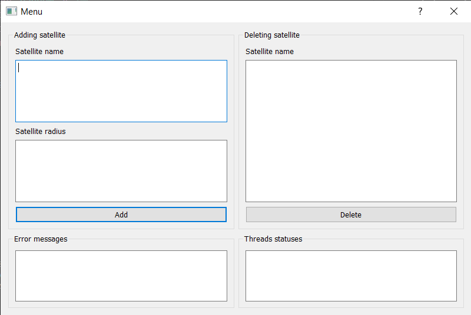

# Systemy-Rozproszone

<p align="center">
  <a href="#pierwsze-kroki">Pierwsze kroki</a> •
  <a href="#wymagania-wstępne">Wymagania wstępne</a> •
  <a href="#instalacja">Instalacja</a> •
  <a href="#stosowanie">Stosowanie</a> •
  <a href="#licencja">Licencja</a>
</p>

Projekt ma na celu stworzenie aplikacji rozporoszonego systemu satelitów. Satelity krążą po orbicie, pojawiając się co określony odstęp czasu w oknie transmisyjnym ziemskiej Stacji Odbiorczej. W czasie trwania okna następuje transmisja zdjęć. Stacja Odbiorcza odbiera pakiety danych z wielu satelitów jednocześnie. Po odebraniu całego zdjęcia, jest ono zapisywane w Międzygalaktycznym Repozytorium obrazów.

## Pierwsze kroki

Dzięki tym instrukcjom uzyskasz kopię projektu uruchomioną na komputerze lokalnym do celów programistycznych i testowych.

### Wymagania wstępne

Rzeczy potrzebne przed zainstalowaniem oprogramowania.

* Edytor kodu
* Python v3.9
* Biblioteki: PyQt5, threading, PIL

### Instalacja

Przewodnik krok po kroku, który powie Ci, jak skonfigurować i uruchomić środowisko programistyczne.

```
$ Sklonowanie repo na lokalny komputer
$ Zainstalowanie potrzebne biblioteki
$ Uruchomienie pliku __main__.py
```

## Stosowanie
Za pomocą panelu aplikacji można dodawać, usuwać oraz kontrolować przesyłanie danych przez satelity.  



## Licencja

AGH